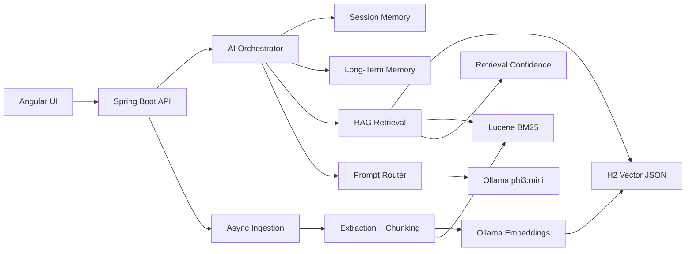

# Enterprise AI Architecture

This branch implements a modular internal AI assistant with local-only RAG for restricted corporate environments.

## Architecture



## Modules

```text
backend/src/main/java/com/example/internalchatbot/
  controller/      REST APIs for chat, sessions, documents, ingestion, LLM
  dto/             request/response contracts without internal vector metadata
  entity/          H2/JPA entities
  repository/      paginated query access and indexed lookups
  config/          CORS, async, Ollama, web, security, RAG config
  ai/
    crawling/
    embeddings/
    ingestion/
    llm/
    memory/
    prompts/
    rag/
    retrieval/
    streaming/
    vectorstore/
```

## Data Model

- `chat_sessions`: user key, title, private mode, active document memory.
- `chat_messages`: short-term conversation memory with trivial acknowledgement filtering.
- `user_memories`: persistent preferences, personal facts, project context, and technical context.
- `chat_questions`: internal DB answers.
- `uploaded_documents`: extracted content, summaries, status, metadata.
- `embeddings_metadata`: chunk text, metadata, vector JSON, document/session/user scope.

## Retrieval Guarantees

- The current active document is searched first.
- Global retrieval is disabled by default.
- Metadata filters are enforced only for high-confidence query intent.
- Low-confidence results trigger semantic and keyword-hybrid fallbacks.
- Low-confidence answer confidence routes to a general AI prompt instead of strict RAG failure.
- Neighboring chunks are expanded to prevent factual fragmentation.
- Prompt context is compact and optimized for `phi3:mini`.
- Only one logical LLM call is made per user message.
- Private mode disables chat history, long-term memory extraction, upload persistence, and embedding storage.

## Operational Notes

- H2 stores durable local data at `backend/data/chatbotdb`.
- Lucene is rebuilt from H2 on startup, so the keyword index is recoverable.
- Private mode avoids chat, document, embedding, and index persistence.
- Source/debug metadata stays backend-only unless clean source references are intentionally returned.
- Future production migration can replace the repository implementation while keeping the AI service contracts intact.
