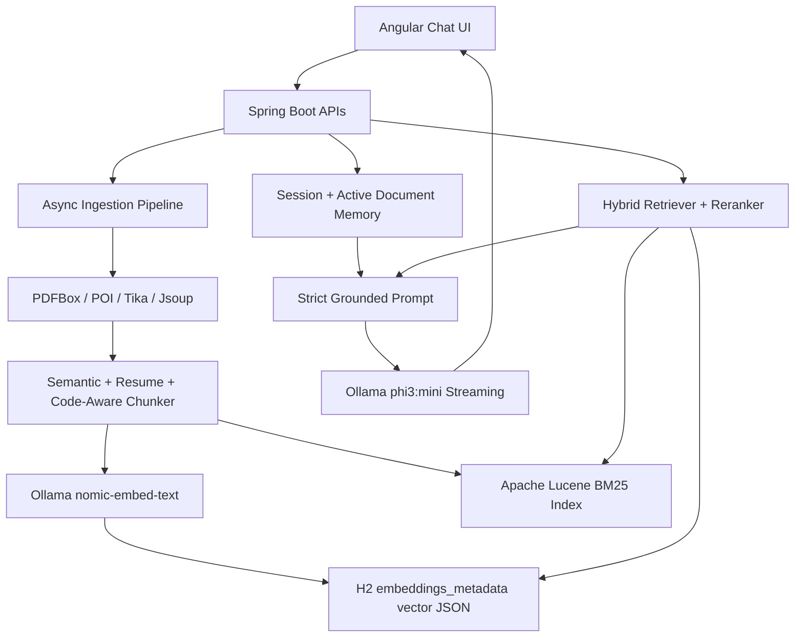

# Mature Local RAG Architecture

This branch uses a corporate-safe RAG stack that stays inside the Spring Boot process and H2 database while preserving ChatGPT-style document QA behavior.

## Architecture Diagram



## Package Structure

```text
ai/
  crawling/       public URL validation, browser-like fetch, readable extraction
  embeddings/     Ollama embedding client with batching and cache
  ingestion/      document extraction, status tracking, summary, chunking
  llm/            Ollama generate/streaming, timeout and retry handling
  memory/         session memory and active document continuity
  prompts/        compact strict RAG prompt construction
  rag/            one-call orchestration and grounding guardrails
  retrieval/      query intent, Lucene BM25, fallback, reranking
  streaming/      SSE response streaming
  vectorstore/    H2 vector JSON storage and Java cosine similarity
```

## H2 Schema

`embeddings_metadata` stores both metadata and vectors:

```sql
document_id bigint,
session_id varchar(36),
user_key varchar(160),
source_name varchar(260),
source_type varchar(40),
source_url varchar(600),
page_number integer,
section_title varchar(260),
document_type varchar(80),
language varchar(80),
topic varchar(160),
chunk_index integer,
token_estimate integer,
content_hash varchar(64),
content_chunk clob not null,
vector_json clob not null,
metadata_json clob
```

Key indexes:

```sql
idx_embeddings_session_private(session_id, private_mode)
idx_embeddings_user_private(user_key, private_mode)
idx_embeddings_document(document_id)
idx_embeddings_document_chunk(document_id, chunk_index, private_mode)
idx_embeddings_document_session(document_id, session_id, private_mode)
idx_embeddings_filter(document_type, language, topic, private_mode)
```

## Ingestion Flow

```text
PDF/DOCX/TXT/CSV/Java/Config/URL
-> extract readable text once
-> infer documentType/language/topic metadata
-> resume-aware or code-aware chunking when applicable
-> overlap chunking to avoid factual fragmentation
-> generate embeddings in batches
-> store vector JSON in H2
-> update Lucene BM25 index
-> generate upload summary
-> set activeDocumentId on the session
```

Private-mode content is never persisted.

## Retrieval Flow

```text
Current question + recent memory
-> one query embedding
-> classify query intent with confidence score
-> active document/session scoped retrieval
-> Lucene BM25 keyword search
-> H2 vector cosine similarity
-> merge scores and metadata boosts
-> low-confidence fallback without strict filters
-> keyword-hybrid fallback
-> rerank with lexical, section, entity, code, and factual boosts
-> expand previous/next chunks
-> compact prompt context
-> one streamed Ollama call
```

This prevents unrelated indexed webpages from winning over the current uploaded resume/document.

## Resume Retrieval

Resume-aware chunking stores section metadata:

- `Education`
- `Experience`
- `Skills`
- `Certifications`
- `Projects`
- `Summary`

Degree/year/university/percentage questions boost education chunks, exact entity matches, year-bearing chunks, and neighboring chunks. A question such as "When did Sachin complete his bachelor degree?" should search the active resume scope first and avoid code/web filters unless query intent confidence is high.

## Code Retrieval

Code-aware chunking preserves:

- Java classes, interfaces, records, enums
- annotations and Spring endpoint mappings
- method-level boundaries
- YAML/properties/XML/JSON configuration entries

Code filters are boost-only by default and become enforced only when intent confidence crosses `rag.intent-filter-threshold`.

## Debug Logs

The backend logs:

- query intent and confidence
- applied metadata filter mode
- embedding dimensions
- Lucene hit count and top BM25 score
- cosine/hybrid top scores
- fallback activation
- reranking scores
- neighboring chunk expansion
- selected chunk count
- prompt character count
- LLM latency

## Production Notes

- Keep `rag.allow-global-retrieval=false` for internal document QA to avoid cross-document leakage.
- Keep `rag.top-k=3` and `rag.max-context-chars=2200` for `phi3:mini`.
- Rebuild Lucene from H2 on startup with `rag.lucene.rebuild-on-startup=true`.
- For very large deployments, replace H2 behind the repository layer with an approved enterprise database and preserve the same retrieval interfaces.
- Do not expose vector IDs, embedding IDs, session IDs, or raw metadata to the UI.
