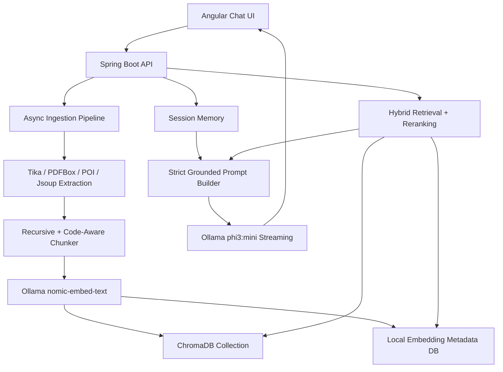

# Mature ChatGPT-Style RAG Architecture

## Architecture Diagram



## Spring Boot Package Structure

```text
ai/
  crawling/       URL validation, browser-like fetch, readable HTML extraction
  embeddings/     nomic-embed-text embedding client with batching/cache
  ingestion/      document extraction, code-aware chunking, indexing status, summary
  llm/            Ollama generation/streaming, timeout and retry handling
  memory/         session-scoped recent conversation memory
  prompts/        strict context-injection prompt builder
  rag/            AI orchestration and one-call response generation
  retrieval/      hybrid retrieval, metadata-aware reranking
  streaming/      SSE response streaming
  vectorstore/    ChromaDB sync plus local vector metadata fallback
```

## Database Schema Additions

`chat_sessions` stores active document memory:

```sql
active_document_id bigint,
active_document_name varchar(260)
```

`embeddings_metadata` stores retrieval metadata per chunk:

```sql
user_key varchar(160),
document_type varchar(80),
language varchar(80),
topic varchar(160)
```

Indexes:

```sql
idx_embeddings_session_private(session_id, private_mode)
idx_embeddings_user_private(user_key, private_mode)
idx_embeddings_document(document_id)
idx_embeddings_hash(content_hash)
idx_embeddings_filter(document_type, language, topic, private_mode)
```

## Chroma Collection Design

Collection: `internal_chatbot_knowledge`

Each vector entry stores:

- `sourceName`
- `sourceType`
- `sessionId`
- `pageNumber`
- `sectionTitle`
- `documentType`
- `language`
- `topic`
- `chunkIndex`
- `contentHash`
- `uploadDate`

The local metadata table mirrors these fields so retrieval keeps working even when ChromaDB is temporarily unavailable.

## Ingestion Flow

```text
PDF/DOCX/TXT/CSV/Java/Config/URL
-> extract readable text once
-> preserve document/page/code metadata
-> chunk with overlap
-> code files split around classes, annotations, endpoints, and methods
-> generate embeddings with nomic-embed-text
-> persist vectors in ChromaDB and local metadata
-> generate concise upload summary
-> set activeDocumentId on the chat session
-> mark indexing complete
```

## Retrieval Flow

```text
User question
-> recent session memory builds retrieval query
-> query embedding
-> active document scoped search when activeDocumentId exists
-> session scoped local semantic + keyword search
-> user scoped long-term search only when no session document exists
-> metadata boosts for code/java/spring/api/config queries
-> rerank candidates
-> keep top 5 chunks
-> inject into strict grounded prompt
-> one streamed Ollama generation call
```

## Memory Flow

- Active document memory: latest successfully indexed upload is stored on the chat session and searched first.
- Long-term memory: uploaded documents, URLs, chunks, embeddings, and metadata scoped by user key.
- Short-term memory: last 20 session messages compressed into the retrieval query and prompt.
- Private mode: skips message persistence, embeddings, and long-term storage.

## Prompt Strategy

The prompt contains:

1. System grounding rules.
2. Recent session memory for pronoun/follow-up resolution.
3. Retrieval query.
4. Internal DB answer if available.
5. Retrieved chunks with filename/page/section/type/language.
6. Current user question.

The LLM is instructed to answer only from grounded context and return `Information not found in the indexed knowledge.` when retrieval does not support the answer.

## Query Intent And Fallbacks

`QueryIntentClassifier` classifies only the current user question, not the expanded memory query. This prevents resume questions from inheriting unrelated Java/Spring tokens from earlier chat memory.

Metadata filters are applied only when the intent confidence crosses `rag.intent-filter-threshold`. The retrieval flow is:

```text
Classify current question
-> if confidence is high, apply metadata filter
-> rerank
-> if top score < rag.low-confidence-score, retry without metadata filters
-> if still weak, retry as keyword-hybrid with boost-only metadata
```

Resume documents are tagged as `documentType=resume` and chunked by sections such as Education, Experience, Skills, Certifications, and Projects. This keeps factual resume questions, for example "When did Sachin complete bachelor degree?", near education chunks instead of older web/code chunks.

## Production Best Practices

- Keep ingestion and chat flows separate.
- Treat active uploaded documents as the first retrieval scope to prevent unrelated global pages from winning.
- Keep query intent filters confidence-gated; do not infer code/Spring intent from generic words such as "service".
- Keep prompt context small; default top-k is 3, max context is 2200 characters, and generation is capped with `ollama.num-predict=256`.
- Never reread uploaded documents during chat.
- Never regenerate document embeddings during chat.
- Use ChromaDB for vector search and local metadata as a resilient hybrid index.
- Keep top-k small and rerank before prompt construction.
- Stream answers with SSE to avoid UI freezing.
- Use source references from clean metadata only; never expose vector IDs or session IDs.
- Re-index old documents after metadata schema changes if code-aware retrieval is needed for existing uploads.
